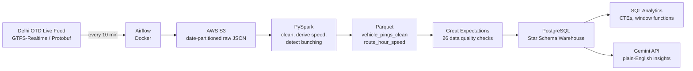

# RouteRadar — Delhi Bus Congestion Analytics Pipeline

A data engineering pipeline that collects Delhi's live bus GPS feed, cleans and processes it, validates its quality, stores it in a warehouse, and generates SQL analytics and a GenAI-powered plain-English insight summary — all running on free-tier tools.

## What it does

Delhi's official live bus feed (GTFS-Realtime) only shows the current moment — once the next update arrives, earlier positions are gone, and the feed itself has real data problems (its speed field is always zero, and its trip IDs don't match the published timetable). RouteRadar solves the underlying **data problem**: it collects the feed continuously, works out real vehicle speed from consecutive GPS positions, checks the data's quality, and stores it in a proper warehouse — so questions like *"which routes are slowest, and when?"* and *"where are buses bunching together?"* can actually be answered with SQL.

## Architecture



## Tech stack

| Layer | Tool |
|---|---|
| Orchestration | Apache Airflow (Docker, LocalExecutor) |
| Ingestion | Python, Protobuf (GTFS-Realtime) |
| Storage (raw) | AWS S3 (date-partitioned) |
| Processing | PySpark (DataFrames, window functions) |
| Data quality | Great Expectations |
| Warehouse | PostgreSQL (star schema) |
| Analytics | SQL (CTEs, window functions, ranking) |
| Insights | Gemini API |
| Infra | Docker Compose |

## Key findings

Two things I discovered while building this, which shaped the design:

1. **The feed's `speed` field is always `0.0`.** Every vehicle report includes a speed value, but it never varies — confirmed across every raw file collected. Speed is instead **derived** from each bus's consecutive GPS positions (haversine distance / time gap), which gives a net-progress speed rather than a speedometer reading — a congestion proxy, not an exact figure.
2. **The live feed's trip IDs don't match the official static timetable.** Cross-checking against Delhi OTD's published GTFS schedule found only 24 of 2,326 live trip IDs matched. This ruled out computing "schedule delay" directly, so the project pivoted to speed and bunching analytics, which the live feed can support reliably on its own.

## Pipeline stages

1. **Ingestion** (`ingestion/`, `dags/`) — Airflow DAG fetches the live feed every 10 minutes, decodes Protobuf, uploads to S3 (`raw/year=X/month=X/day=X/`), and fails/retries if the feed returns zero records.
2. **Transformation** (`transformation/`) — PySpark reads raw JSON, cleans and de-duplicates pings, filters to Delhi's bounding box, derives speed and a moving/bunching flag per ping, and aggregates to route-hour metrics. Writes partitioned Parquet.
3. **Data quality** (`quality/`) — Great Expectations runs 26 checks (nulls, valid ranges, uniqueness, cross-column consistency) across both datasets before they reach the warehouse.
4. **Warehouse** (`warehouse/`) — A star schema in PostgreSQL: two fact tables (`fact_route_hour_speed`, `fact_vehicle_ping`) and four dimensions (`dim_date`, `dim_hour`, `dim_route`, `dim_vehicle`). Loaded by an idempotent Python script (upserts, safe to re-run).
5. **SQL analytics** (`sql/analytics.sql`) — Five queries using CTEs, window functions (`RANK()`, `LAG()`), `CASE`, and aggregation: slowest route-hours, per-hour ranking, congestion by time-of-day, bunching rate per route, and day-over-day speed trends.
6. **GenAI insights** (`genai/`) — Pulls the slowest routes and worst-bunching routes from the warehouse and asks the Gemini API to write a short, plain-English summary for a transit planner.

## Sample results (from real collected data)

- Fleet-wide: ~71% of tracked buses were moving at any given snapshot; average moving speed ~8.8 km/h.
- Slowest observed: Route 1914 at 20:00–20:59, averaging 3.87 km/h across 3 buses.
- Worst bunching: Route 2657, where 80% of its moving GPS pings showed another bus on the same route within 300 metres.
- Evening peak (16:00–20:59) averaged slower speeds than midday across the collected sample.

## Running it

```bash
# 1. Start Airflow, Postgres (Airflow's) and the warehouse
docker compose up -d

# 2. Let ingestion collect for a while (every 10 min), then run:
# (venv, with JAVA_HOME / HADOOP_HOME set)
python transformation/transform_speed_analytics.py --input "raw_data/*.json" --output processed_data

# 3. Validate (venv-dq)
python quality/validate_data.py --input processed_data

# 4. Load the warehouse (venv-dq)
python warehouse/load_warehouse.py --input processed_data

# 5. Run SQL analytics
docker compose exec -T warehouse psql -U dw_admin -d transit_dw < sql/analytics.sql

# 6. Generate a GenAI insight summary (venv-dq)
python genai/generate_insights.py
```

Requires a `.env` file (not committed) with: `DELHI_OTD_API_KEY`, `DELHI_OTD_BASE_URL`, `AWS_ACCESS_KEY_ID`, `AWS_SECRET_ACCESS_KEY`, `AWS_REGION`, `S3_BUCKET_NAME`, `WAREHOUSE_PASSWORD`, `GEMINI_API_KEY`.

## Known limitations

- Derived speed is net progress between two GPS points, not true road speed — it reads lower than reality on winding routes, and is a congestion indicator rather than an exact measurement.
- Because the live feed's trip IDs don't match the official static timetable, schedule-delay (actual vs. scheduled arrival) is not computed — this pipeline measures observed congestion and bunching instead.
- `route_long_name` in the warehouse is currently blank, since no matching static timetable is available yet to join against.
- Runs on a single machine; Airflow's webserver container needs a `docker compose up -d --force-recreate airflow-webserver` after an unclean host shutdown (documented, not yet automated).

## Roadmap

- Chain Spark → quality checks → warehouse load as a single Airflow DAG
- Load the same schema into Snowflake
- Train a model to predict route speed by hour/day-of-week
- Serve results via FastAPI and a Power BI dashboard